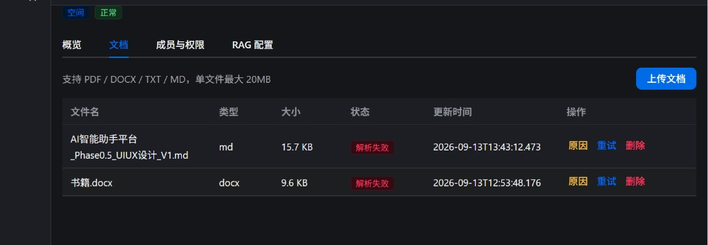
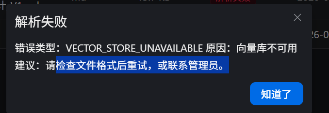
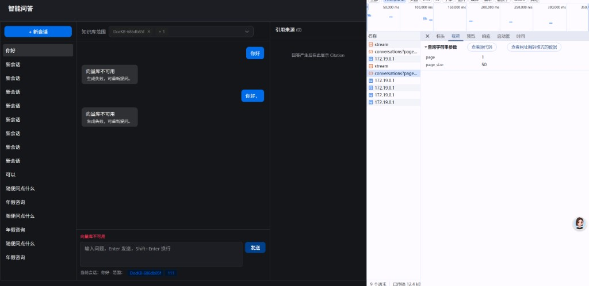
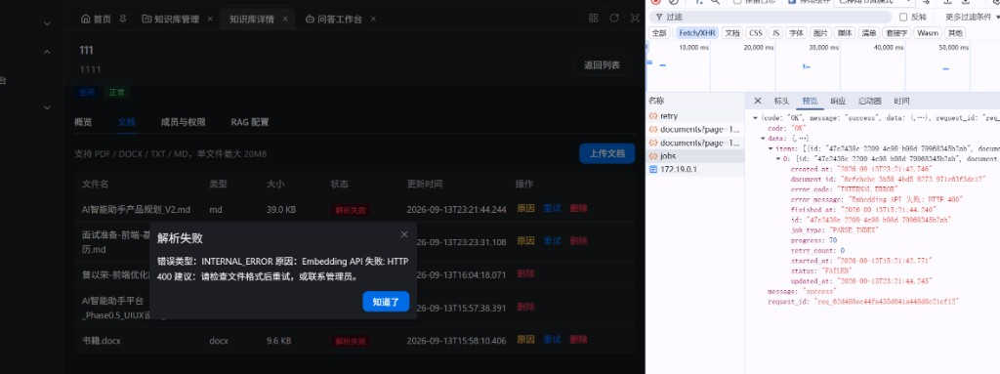
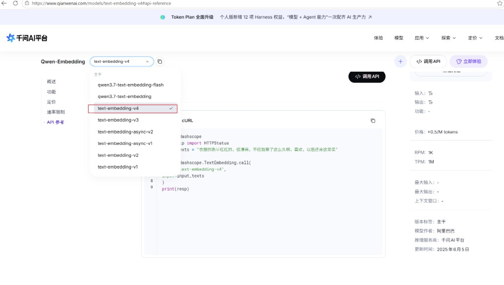
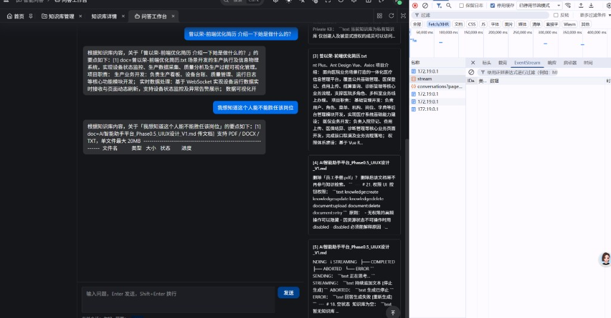

# 里程碑 M1 — 问题与修复记录（Bugs & Fixes）

> 范围：从 Phase 0.5 UI 审查通过 → 「真实 RAG 主路径可演示」  
> 日期：2026-09-13 ~ 2026-09-14  
> 目的：固化联调/测试中出现的问题、根因与修复，避免重复踩坑

---

## 1. 如何使用本文档

- 开发联调遇同类报错：先按「错误现象」检索  
- 换 Embedding / LLM 供应商前：重读 §3、§4、§6  
- 新同学上手：与 [里程碑 M1 阶段总结](./milestone-M1-deep-summary.md) 一起读  

---

## 2. 问题清单总表

| ID | 严重度 | 现象 | 根因归类 | 状态 | 截图 |
|---|---|---|---|---|---|
| B1 | P0 | 文档解析失败 / 问答「向量库不可用」 | 本机 HTTP 代理劫持 Qdrant | 已修复 | [见下](#3-b1--windows-系统代理导致-qdrant-502) |
| B2 | P0 | 接入阿里云 Embedding 后解析失败 HTTP 400 | 单批超过 DashScope 上限 10 | 已修复 | [见下](#4-b2--阿里云-embedding-批次超限-http-400) |
| B3 | P1 | 回答「一下子全部出来」，不符合流式体验 | Fake LLM 无间隔 + 代理缓冲 | 已缓解 | [见下](#5-b3--流式体验一次吐完) |
| B4 | P1 | 上传成功但无法问答 | 文档未 READY / 向量未写入 | 流程说明 | 同 B1 列表图 |
| B5 | P2 | MD 失败时误以为是格式问题 | 错误文案偏「查格式」 | 部分改善 | 见 B1 弹窗「建议」 |
| B6 | P2 | docx 一律解析失败 | 解析器未实现（预期缺口） | 已知未做 | 见 B1 列表中 `书籍.docx` |
| B7 | 运维 | 改 `.env` 后行为不变 | Settings 缓存 / 未整进程重启 | 操作约定 | — |
| B8 | 安全 | Key 出现在对话/截图中 | 本地联调泄露面 | 需轮换习惯 | — |
| B9 | P1 | Citation 侧栏显示文档 ID 而非文件名 | 历史消息未回填 `document_name` | 已修复 | — |
| B10 | P2 | 按文件名提问却召回同主题其他文档 | 纯语义检索无文件名约束 | 已增强 | — |
| B11 | P0 | 删除已问答过的文档报 INTERNAL_ERROR | `message_citation` 外键挡住删 chunk | 已修复 | — |

截图统一存放：[`plan/assets/`](./assets/)（文件名 `bug-B*` / `ref-*`）。

---

## 3. B1 — Windows 系统代理导致 Qdrant 502

### 现象
- 文档状态：**解析失败**
- 原因弹窗：`VECTOR_STORE_UNAVAILABLE` / 「向量库不可用」
- Chat 提问同样报「向量库不可用」
- `docker ps` 显示 `aap-qdrant` **healthy**；`curl http://127.0.0.1:6333/readyz` 为 200
- 后端 `/ready` 曾返回 `qdrant: fail`

#### 截图

文档列表（MD 解析失败；docx 为已知未实现）：



原因弹窗（向量库不可用；建议文案仍偏向「查格式」→ 见 B5）：



智能问答同样失败：



### 根因
- Windows 系统代理指向本地 Clash 等（如 `127.0.0.1:7890`）
- Python `httpx` / `qdrant-client` 默认 `trust_env=True`，访问 `127.0.0.1:6333` 也走代理 → **502 Bad Gateway**
- `curl` 往往直连本机，所以「命令行正常、应用失败」

### 修复
- `backend/app/api/health.py`：健康检查 `httpx.AsyncClient(..., trust_env=False)`
- `backend/app/ai/vectorstore/qdrant.py`：`AsyncQdrantClient(..., trust_env=False)`

### 经验
- **本地基础设施（MySQL/Qdrant）访问应绕过系统代理**；外网 LLM/Embedding 仍可走代理
- 排障顺序：容器 healthy → curl 本机端口 → **用与后端相同的 HTTP 客户端**复现

---

## 4. B2 — 阿里云 Embedding 批次超限 HTTP 400

### 现象
- 文档解析失败：`INTERNAL_ERROR` / `Embedding API 失败: HTTP 400`
- 多 chunk 的 MD 更容易复现；短文档有时偶然成功

#### 截图



选型参考（百炼 `text-embedding-v4` API 页）：



### 根因
- DashScope `text-embedding-v3/v4`：**单次 input 最多 10 条**
- 客户端原 `batch_size=64`，分块稍多即 400：  
  `batch size is invalid, it should not be larger than 10`

### 修复
- `EMBEDDING_BATCH_SIZE` 默认改为 **10**（`config` + `.env.example`）
- 请求补充 `dimensions`、`encoding_format=float`（与百炼兼容模式对齐）
- Pipeline 失败消息附带 API `details`，便于下次直接看清供应商报错

### 经验
- **Embedding 供应商限制 ≠ OpenAI 默认假设**；换厂商先查「最大行数 / Token」
- 换维度时建议换 `QDRANT_COLLECTION`（如 `knowledge_chunks_aliyun`），并 **重试/重建文档索引**

---

## 5. B3 — 流式体验「一次吐完」

### 现象
- 计划要求 STREAMING 打字机效果；实测回答几乎瞬间完整出现
- DevTools EventStream 有时看不清逐条帧

#### 截图



### 根因（叠加）
1. 当时 `LLM_PROVIDER=fake`：按字切片但 **无延时**，毫秒级全部 yield  
2. Vite 开发代理可能加重短流缓冲观感  

### 修复 / 缓解
- Fake LLM：增加 chunk 间隔（演示用）
- Chat SSE：每帧后 `asyncio.sleep(0)` 利于刷出
- Vite `/api` 代理：对 `text/event-stream` 设置防缓冲相关头

### 经验
- **真实 LLM** 下应主要依赖模型侧 token 流；Fake 间隔仅用于本地 UX 演示
- 改 `vite.config.ts` 后需 **重启** `pnpm run dev:ele`

---

## 6. B4 — 上传成功 ≠ 可问答

### 现象
- 列表有文档，但问答无依据或检索失败

### 说明（非纯代码 Bug）
上传成功只表示：
1. 文件落盘：`backend/data/files/{org}/{kb}/{doc_id}/{filename}`
2. MySQL `document` / `document_job` 有记录  

可问答还要求：
- Job 走完 PARSE → EMBED → INDEX  
- 状态 **READY**  
- 向量在当前 `QDRANT_COLLECTION` 中  

### 操作约定
- 先点「原因」看 `error_code`  
- 修环境后对 FAILED 文档点 **重试**  
- 换 Embedding/维度后：**整库文档重试**，不要假设旧向量仍可用  

---

## 7. B5 — 失败文案误导

### 现象
- 向量库/Embedding 失败时，UI 仍提示「请检查文件格式…」

### 改善
- 后端 job 写入更具体的 `error_message`（含供应商细节）
- 前端「原因」弹窗已展示 `error_code` + `error_message`  
- 建议后续：按错误码映射文案（格式问题 vs 依赖不可用 vs 配额）

---

## 8. B6 — DOCX/PDF 解析失败（已知范围外）

### 现象
- `书籍.docx` 等解析失败（预期）

### 说明
- 一期上传允许 PDF/DOCX，但解析器仍为骨架；**TXT/MD 才是 M1 验收格式**
- 列入下一里程碑 M2，见 [下一目标规划](./milestone-M2-next-goals.md)

---

## 9. B7 — 配置变更未生效

### 现象
- `.env` 已改 `LLM_PROVIDER` / `EMBEDDING_*`，行为仍像 fake 或旧 collection

### 原因
- Pydantic Settings / 进程内单例（Embedding/LLM client）不会因文件保存自动重建  
- `--reload` 主要盯代码，**不保证重载 `.env`**

### 约定
```text
改 .env → Ctrl+C 停 uvicorn → 重新启动
改 vite 代理 → 重启 pnpm run dev:ele
```

自检：
```text
GET http://127.0.0.1:8000/ready  → mysql/qdrant ok
```

---

## 10. B8 — 密钥与安全（补充）

### 风险
- 本地 `.env`、聊天截图、Agent 对话可能带出 API Key  

### 约定
- **永不提交** `.env`（仅维护 `.env.example` 占位）  
- Key 曾暴露在对话/截图时：**到 DeepSeek / 百炼控制台轮换**  
- 对外演示用独立 Key + 限额  

---

## 11. 联调检查清单（验收用）

```text
□ Qdrant 容器 Up + /readyz 200
□ GET /ready → mysql ok, qdrant ok
□ 登录 admin / Admin@123456
□ 新建知识库，上传 TXT 或 MD
□ 状态变为「已就绪」（非解析失败）
□ 智能问答选该知识库提问
□ 回答流式出现；右侧 Citation 非空（有检索命中时）
□ （可选）成员增删、RAG 配置保存
□ DOCX/PDF 失败视为已知，不计入 M1 失败
```

---

## 12. 相关代码与提交（参考）

| 主题 | 位置 / 提交提示 |
|---|---|
| 代理绕过 | `app/api/health.py`, `app/ai/vectorstore/qdrant.py` |
| Embedding 批次 | `app/ai/embedding/openai_compatible.py`, `EMBEDDING_BATCH_SIZE` |
| Fake 流式 | `app/ai/llm/fake.py`, `modules/conversation/chat.py` |
| Vite SSE | `frontend/apps/web-ele/vite.config.ts` |
| 示例提交 | `fix: 阿里云 Embedding 批次限制为 10` 等 |

---

## 13. 变更记录

| 日期 | 内容 |
|---|---|
| 2026-09-14 | 初版：汇总 M1 联调 Bugs 与修复/约定 |
| 2026-09-14 | 将联调截图归档至 `plan/assets/` 并在本文挂载 |
| 2026-09-14 | B9 Citation 回填文件名；B10 问题含文件名时优先检索该文档 |

---

## 附录 A — `plan/assets` 截图索引

| 文件 | 对应 |
|---|---|
| `bug-B1-doc-list-parse-failed.png` | B1/B4/B6 文档列表解析失败 |
| `bug-B1-vector-store-unavailable-modal.png` | B1/B5 向量库不可用弹窗 |
| `bug-B1-chat-vector-unavailable.png` | B1 问答失败 |
| `bug-B2-embedding-http-400.png` | B2 Embedding HTTP 400 |
| `bug-B3-sse-streaming-devtools.png` | B3 流式 / EventStream |
| `ref-aliyun-text-embedding-v4-api.png` | 百炼 v4 API 参考（非故障界面） |
