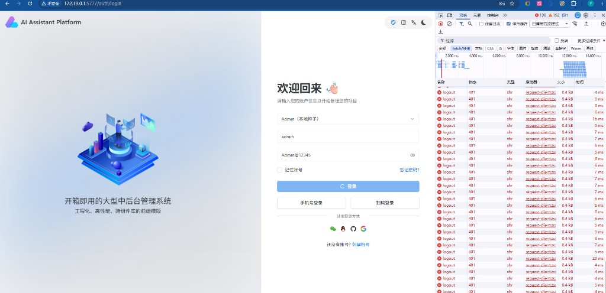
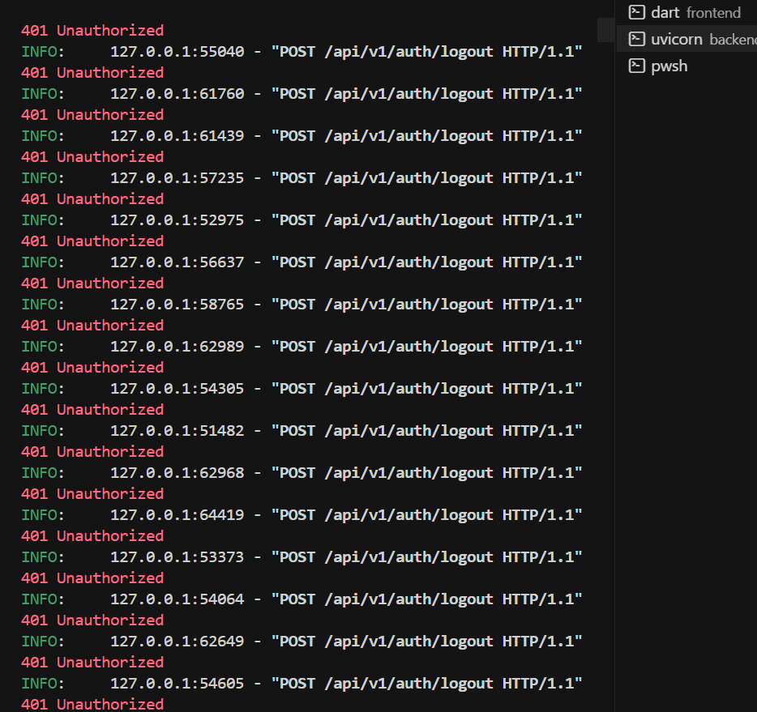
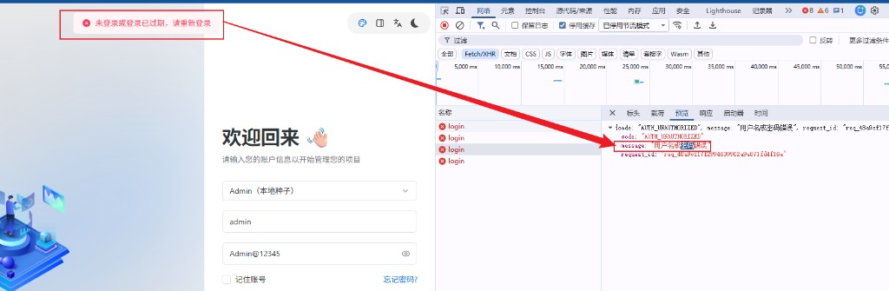

# 里程碑 M4 / M5 — 问题与修复记录（Bugs & Fixes）

> 范围：M4 体验与治理验收后 → M5 审计联调期间  
> 日期：2026-09-14  
> 关联：[M4 完成说明](./milestone-M4-completion.md) · [M5 目标](./milestone-M5-next-goals.md) · [M1 Bugs 总册](./milestone-M1-bugs-and-fixes.md)（B1–B12）

编号自 **B13** 起续排，避免与 M1 文档冲突。

---

## 1. 问题清单总表

| ID | 严重度 | 现象 | 根因归类 | 引入方 | 状态 | 截图 |
|---|---|---|---|---|---|---|
| B13 | P0 | 密码输错后疯狂请求 `POST /auth/logout`（401 刷屏） | 鉴权拦截器把登录 401 当会话过期 | **原框架/脚手架**（接真实 Auth 后暴露） | 已修复 | [见下](#2-b13--登录失败触发-logout-死循环) |
| B14 | P1 | Toast 显示「未登录或登录已过期」，后端实为「用户名或密码错误」 | `code` 映射盖住后端 `message` | **M4 错误文案体系** | 已修复 | [见下](#3-b14--登录错误提示与后端-message-不一致) |

截图：[`plan/assets/`](./assets/)（`bug-B13-*` / `bug-B14-*`）。

---

## 2. B13 — 登录失败触发 logout 死循环

### 现象
- 登录页输入错误密码后，登录按钮长时间 loading
- Network：大量 `logout` 请求，均为 **401**
- 后端 uvicorn 日志连续：`POST /api/v1/auth/logout` → 401

#### 截图

前端 Network 刷屏 logout：

后端日志连续 401：

### 根因
1. 后端登录失败返回 HTTP **401** + `AUTH_UNAUTHORIZED`（契约正确）
2. Vben `authenticateResponseInterceptor`：**任意 401** → `doReAuthenticate` → `authStore.logout()`
3. `logoutApi` 走带同一拦截器的 `requestClient`；无有效 Token 时 logout 再 401 → 再次 `doReAuthenticate`
4. 形成：`login 401 → logout 401 → logout 401 → …`

**结论：** 属脚手架鉴权预设与「登录失败也用 401」组合问题；**不是 M5 审计写入引入**。M5 验收测错密时首次暴露。

### 修复
| 位置 | 改动 |
|---|---|
| `frontend/packages/effects/request/.../preset-interceptors.ts` | `/auth/login`、`/auth/logout`、`/auth/refresh` 的 401 **不**触发 re-auth |
| `apps/web-ele/src/api/request.ts` | `doReAuthenticate` 防重入；无 token 时不再调 logout |
| `apps/web-ele/src/api/core/auth.ts` | `logoutApi` 改走 `baseRequestClient`，手动带 Bearer |
| `apps/web-ele/src/store/auth.ts` | 仅有 token 时才调 logout API |

提交：`84323ed`（`fix: 登录失败 401 不再触发 logout 死循环…`）

### 经验
- **登录失败 ≠ 会话过期**；鉴权拦截器必须排除 auth 自身路径
- logout 客户端应避免再进「401 → logout」链路

---

## 3. B14 — 登录错误提示与后端 message 不一致

### 现象
- 后端响应：`code=AUTH_UNAUTHORIZED`，`message=用户名或密码错误`
- 前端 Toast：`未登录或登录已过期，请重新登录`

#### 截图

### 根因
- M4 引入 `resolveErrorMessage`：**优先** `API_ERROR_MESSAGES[code]`
- 将 `AUTH_UNAUTHORIZED` 固定映射为「未登录或登录已过期」
- 同一 code 既用于「密码错误」也用于「Token 无效」，映射盖住了后端上下文 `message`

**结论：** **由 M4 错误文案体系引入**；修复后约定：有后端 `message` 时优先展示。

### 修复
| 位置 | 改动 |
|---|---|
| `apps/web-ele/src/utils/error-messages.ts` | 优先 `fallback`（后端 message），无则再用 code 映射 |
| `apps/web-ele/src/api/request.ts` | 拦截器传入后端 `message`，不再用 HTTP 通用文案覆盖 |

同提交：`84323ed`

### 经验
- **业务判断靠 `code`，用户可见文案优先后端 `message`**
- 一码多义时，不要用单一静态文案硬覆盖

---

## 4. 与 M4 收尾的关系

| 项 | 说明 |
|---|---|
| M4 Must | 已验收通过（成员 / 错误体系 / Job 进度） |
| M4 引入债 | B14（错误 map 优先级）— **已修** |
| M4 Should → M5 | 审计日志 — 在 M5 进行中 |
| M5 联调暴露 | B13（框架）+ B14（M4）— 均已修并归档本文 |

---

## 5. 变更记录

| 日期 | 内容 |
|---|---|
| 2026-09-14 | 初版：归档 B13 / B14；截图入 `plan/assets/` |
