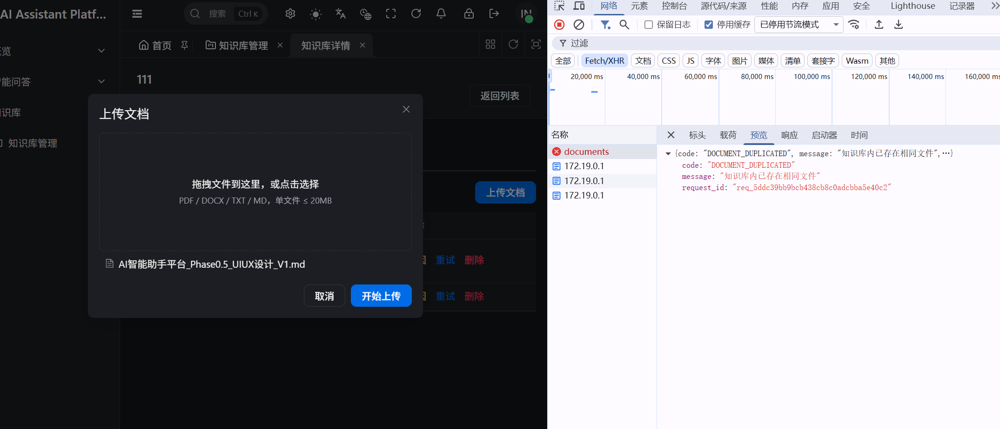

2026.09.13
一期核心链路（Auth → KB → 文档 → 向量 → Chat SSE）和业务 UI 主路径已经齐了。接下来建议按这个顺序：

1. 先联调冒烟（今天就能做）
端到端走一遍，再决定下一块编码：

登录 → 新建知识库 → 上传 TXT/MD → 等到 READY
智能问答提问 → 看流式回复 + Citation
成员增删、RAG 保存各试一次
有 bug 先修，别急着加功能。

合理